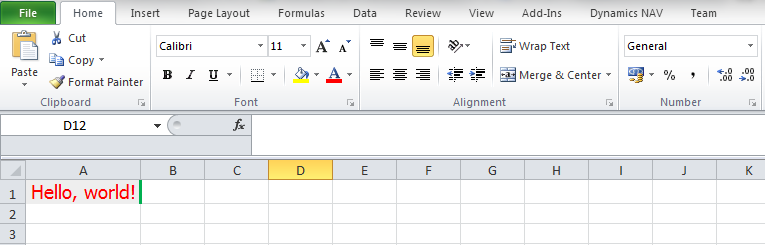
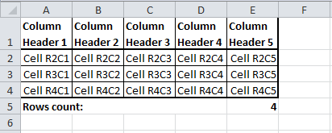
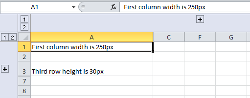

# Excel Buffer Extended

This tool allows to export data from NAV to Excel with additional formatting:
<ul>
<li>Change font name, size and color</li>
<li>Create borders</li>
<li>Make horizonal and vertical alignment</li>
<li>Add comments to cells</li>
<li>Add images</li>
<li>Group rows and columns</li>
</ul>

## Examples

File [Examples.txt](Examples.txt) contains three functions that show how to use this tool.

1. Function `GeneralFormatting()` shows how to use "Excel Buffer Extended" record directly.
```
CLEAR(xlBuf);
xlBuf.VALIDATE("Row No.",1);
xlBuf.VALIDATE("Column No.",1);
xlBuf."Cell Value as Text" := 'Hello, world!';
xlBuf."Font Name" := 'Tahoma';
xlBuf."Font Color" := FORMAT(xlBuf.Color::Red);
xlBuf."Font Size" := 14;
xlBuf."Horizontal Alignment" := xlBuf."Horizontal Alignment"::Center;
xlBuf."Right Border Style" := xlBuf."Right Border Style"::Thick;
xlBuf."Right Border Color" := FORMAT(xlBuf.Color::Green);
xlBuf."Background Color" := 'FFEEEEEE';
xlBuf.INSERT;
xlBuf.CreateBookAndOpenExcel('','Sheet1','',COMPANYNAME,USERID);
```


2. Function `UseProperties()` shows how to use functions `SetDefaultProperies` and `AddColumnPr`.
This function generates a file of the following format:



3. Function `ChangeRowsColumnsProperties()` shows how to change row height and column width, how to hide and group rows and columns.



## Requirements

Microsoft Dynamics NAV 2017
