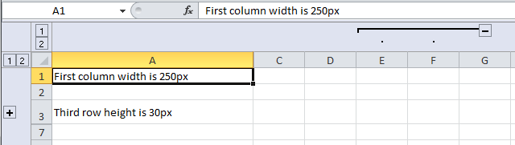

# Excel Buffer Extended

This tool allows to export data from NAV to Excel with extended formatting:
- Change font name, size and color
- Create borders
- Make horizonal and vertical alignment
- Add comments to cells
- Add images
- Group rows and columns

No additional or external components required.

## Instalation

1. Download file [Table50000.txt](Table50000.txt).
2. If you want to change object id then open file in text editor and replace all instances of the string "50000" with the new object id.
3. Import file to Nav 2017 and compile it. 

## Examples

File [Examples.txt](Examples.txt) contains three functions that show how to use this tool.

1. Function `GeneralFormatting()` shows how to use "Excel Buffer Extended" record directly.
```
CLEAR(xlBuf);
xlBuf.VALIDATE("Row No.",1);
xlBuf.VALIDATE("Column No.",1);
xlBuf."Cell Value as Text" := 'Hello, world!';
xlBuf."Font Name" := 'Tahoma';
xlBuf."Font Color" := FORMAT(xlBuf.Color::Red);
xlBuf."Font Size" := 14;
xlBuf."Horizontal Alignment" := xlBuf."Horizontal Alignment"::Center;
xlBuf."Right Border Style" := xlBuf."Right Border Style"::Thick;
xlBuf."Right Border Color" := FORMAT(xlBuf.Color::Green);
xlBuf."Background Color" := 'FFEEEEEE';
xlBuf.INSERT;
xlBuf.CreateBookAndOpenExcel('','Sheet1','',COMPANYNAME,USERID);
```


2. Function `UseProperties()` shows how to use functions `SetDefaultProperies` and `AddColumnPr`.
This function generates a file of the following format:


3. Function `ChangeRowsColumnsProperties()` shows how to change row height and column width, how to hide and group rows and columns.



## Requirements

Microsoft Dynamics NAV 2017
