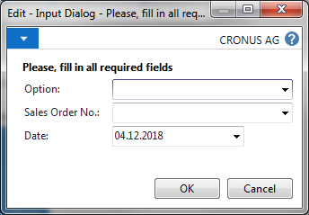

# Input Dialog

Dialog page with 4 dynamic fields to enter data.
```
SalesHeader.RESET;
SalesHeader.SETRANGE("Document Type",SalesHeader."Document Type"::Order);

InputDialog.AddHeaderText('Please, fill in all required fields');
InputDialog.AddField(1,'Option',0,'',0,'Value1,Value2,Value3');
InputDialog.AddField(2,'Sales Order No.',0,'',36,SalesHeader.GETVIEW);
InputDialog.AddField(3,'Date',3,TODAY,0,'');
IF InputDialog.RUNMODAL = ACTION::OK THEN
  MESSAGE('OK');
```

